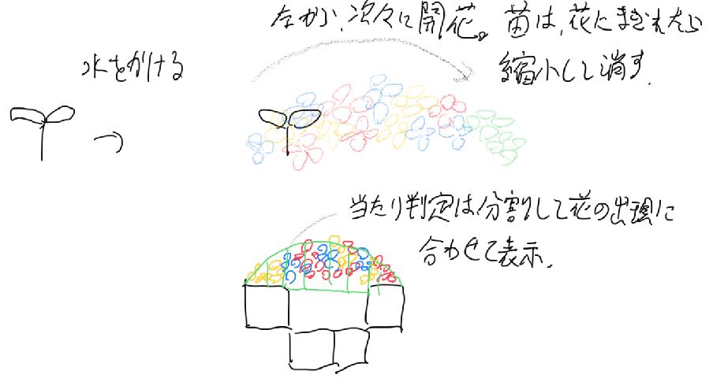

# 花の橋
花の橋は構造的にはシンプルだが、花をアーチ状に並べるのが面倒、ということがあり、プログラムで発生させることにした。

## 仕様

### 動き
- 水を掛けると、一輪の花が咲いて、苗が縮小して、花が着地
- 水をかけた方向に向かって、2ブロック分を飛び越せる長さで花がアーチ状に咲いて橋になる
- 花で苗が隠れる程度になったら、苗を消す
- 当たり判定は、見えないブロックか球体を、花が表示されるのに合わせて並べて作る
- 花は見えやすいように、手前に15度傾かせる

### 配置
配置はプログラムで行う。苗があったブロックの端を起点にして、一定の規則でアーチ状に並べる。配置は済ませておき、アニメの開始を、後でプログラムで行う。

## 実装

### 花のプレハブ作成
花のモデルであるstella_flower_blue, stella_flower_red, stella_flower_yellowをそのまま使うと、アニメーションを個別に作らないといけないので面倒である。そこで、以下のようなプレハブを作成して、アニメーションを使いまわせるようにする。

- FlowerBlueという名前の空のゲームオブジェクトを作成する
- stella_flower_blueを、このゲームオブジェクトの子供にして、右クリックしてUnpack Prefabでプレハブを解除する
  - 花単体を別のプレハブで利用する場合はプレハブのままにしておく方がよいが、多重プレハブにするといちいち変更のたびにプレハブを開く必要が出て煩雑である。使いまわす必要がない場合は、子供のオブジェクトはプレハブ解除しておく方が楽な場合があるので、今回は敢えてそうしている
- stella_flower_blueの名前を`flower`に変更する
- flowerのRotationのXを`-15`にして、少し手前に傾ける
- FlowerBlueオブジェクトに、以下のものをアタッチ
  - Animator
  - `FlowerBridge`という名前のスクリプトを作成してアタッチ

一先ず以上。あとは必要に応じて追加していく。

### アーチの配置
始点、半径、方向、花のプレハブを受け取って、指定のオブジェクトを生成するコードを作成する。このコードはFlowerLeafに持たせる。

形や配置は実際に見ながら調整したいので、`OnValidate()`メソッドから花の配置コードを呼び出すことで、動的に花の橋が変化するように作成する。

アーチの計算方法は以下の通り。

- 始点を終点を決める
- 始点と終点それぞれについて、半径の円の式を作る
  - (x-中心点X)^2+(y-中心点Y)^2 = 半径^2

始点の中心Xをsx、終点の中心をex、始点の中心Yをsy、終点の中心Yをeyとすると、式は以下の通り。

(x-sx)^2+(y-sy)^2 = r^2
(x-ex)^2+(y-ey)^2 = r^2

sy = eyなので、上式から下式を引いて以下の式を得られる。

(x-sx)^2 - (x-ex)^2 = 0

式を展開して整理する。

x^2-2sx*x+sx^2 - (x^2 - 2ex*x + ex^2) = 0
(2ex-2sx)x + sx^2 - ex^2 = 0
x = (ex^2-sx^2) / (2ex-2sx)

これで、中心点xの値を求めることができる。

yについて式を整理する。

(y-sy)^2 = r^2 - (x-sx)^2

Y = y-syとすると、

Y^2 = r^2 - (x-sx)^2
Y = +-Sqrt(r^2-(x-sx)^2)

今回は下を中心とするので、 Y = -Sqrt(r^2 - (x-sx)^2)のみ。

Yを元に戻す。

y-sy = -Sqrt(r^2 - (x-sx)^2)
y = sy - Sqrt(r^2 - (x-sx)^2)

x座標とsx、sy、半径を上の式に代入すればYが求まる。以上で、橋のアーチの中心点が求まる。

あとは、以下の手順で花を配置する。

- 中心から、始点と終点の角度を求める
- 花の数でループを回して、視点から終点までの角度を等分する場所に花を配置していく

## 飾り花
中心の花の間に、奥と手前それぞれ飾りの花を増やす。

(中心の花の数-1)*2の数を用意して、Xは中心の花の間として、YとZのオフセットを設定して、奥なら足して、手前なら引いて、座標を求める。
