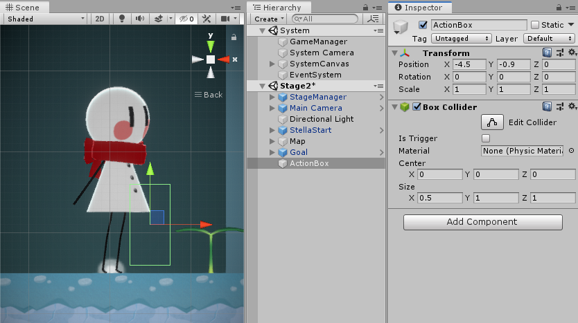
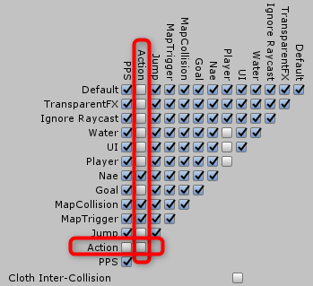

# 苗の持ち運び
苗は、アクションキーで運ぶことができる。

## 処理の流れ
- 立っている状態で、アクションキーを押して、最寄りが苗だった時に持ち運び状態に遷移
- アクションキーをもう一度押すか、水キーを押すと、苗を足元に置く
- 苗を置く場所は、0.25か0.5単位で調整
- すでに何か置いてある場所には置けない
- 段差のあるところには置かない
- 高い段差の手前の場合は足元に植える
- 苗を持っている状態ではジャンプできない
- 苗を持っている状態では、ツタの昇り降りはできない
- 苗を持っている状態で水に落ちると、苗を取り落として苗は落下

## アクションキー
アクションキーは状況に応じで行動が変化する。ステラの前方の一定の範囲を探索して、見つけた行動オブジェクトのうち、もっともステラに近いものについて行動を起こす。まずは探索する範囲を調べる処理を実装する。

### アクションキーの仕様
現在有効なオブジェクトは、将来的に光らせたりエッジを描画するなどして分かるようにしたいので、常時選択しておくようにしたい。そのため、ActionBoxにスクリプトを設定して、OnTrigger????で、常に接触しているオブジェクトを見つけるようにする。

- ステラから一定の相対座標の場所を常に監視して、行動が可能なオブジェクトをリストアップし、そのうちの最寄りのものを見つけておく
- 行動できる相手のオブジェクトには、Actableクラスを継承したクラスを作成してアタッチする。このクラスは`CanAction`プロパティーと`Action()`メソッドを実装する
- 行動範囲にあるオブジェクトがActableクラスを持ち、かつ、CanActionがtrueの場合、行動候補にリストアップする
- アクションキーが押されたら、検出済みの最寄りのオブジェクトのAction()メソッドを呼び出すことで、行動を開始する。どのような行動をするかは、Actable.Action()が管理するので、ステラのアクションキーの処理はここまでで終わり


### 探索範囲トリガーの作成
- Hierarchyウィンドウで空のゲームオブジェクトを作成して、`ActionBox`という名前にしておく
- ActionBoxに*BoxCollider*をアタッチする
- ActionBoxのTransformのPositionは0,0,0としておいて、位置と大きさはBoxColliderのCenterとSizeで調整して、行動相手を検出したい範囲をコライダーが示すようにする



- 調整ができたら、ProjectウィンドウからStellaプレハブをHierarchyにドラッグ＆ドロップして開く
- Hierarchyウィンドウにおいて、ActionBoxをドラッグして、Stellaにドロップして子供にする
- Inspectorウィンドウで、ActionBoxに以下の設定をする
  - TagとLayerにActionを追加して、どちらもActionにする
  - Is Triggerにチェック
- 変更を反映させるために、StellaのOverridesからApply Allをクリックしてすべて適用

以上が完了したら、HierarchyウィンドウからStellaオブジェクトを削除する。

### 接触の設定
不要なオブジェクトが反応しないようにレイヤーを設定する。Actionが検出したいのは、*Nae*, *MapCollision*, *MapTrigger*の3種類のレイヤーのみなので、Physics設定でそのように設定する。




### スクリプト実装
検出したアクションオブジェクトを管理するためのActableクラスを作成する。

```cs
using UnityEngine;

namespace GreeningEx2019
{
    /// <summary>
    /// アクションキーで動作する対象のオブジェクトは、このクラスを継承して実装します。
    /// </summary>
    public abstract class Actable : MonoBehaviour
    {
        /// <summary>
        /// 行動可能な時、trueを返します。
        /// </summary>
        public bool CanAction { get; protected set; }

        /// <summary>
        /// 行動を実行します。
        /// </summary>
        public abstract void Action();

        /// <summary>
        /// 選択された時に呼び出します。
        /// </summary>
        public virtual void Select() { }

        /// <summary>
        /// 選択を解除します。
        /// </summary>
        public virtual void Deselect() { }
    }
}
```

ActionBoxスクリプトを新規に作成して、ActionBoxオブジェクトにアタッチしてコードを作成する。実装するのは以下のような項目。

- ActionBoxに触れているアクション可能なオブジェクトのインスタンスを保持する配列を定義
- Physics.BoxCastNonAlloc()を使って、設定したActionBoxの範囲内にあるオブジェクトを列挙して、最寄りのオブジェクトを返すメソッドを作成
- BoxCastNonAllocのCenterを設定する際には、XのオフセットをStellaMove.forwardVector.xを掛けて左右フリップを反映させること

#### メモ
当初、OnTriggerEnter()などで作成してみたのだが、トリガーを発動してくれないことが判明した。CharacterControllerだと子供のColliderは動作しない可能性があったため、BoxCastNonAllocに変更した。

## 苗用のアクションを作成する
アクションを呼び出す処理ができたら、苗のアクションを作成してアタッチする。まずは単純に呼び出しが成功しているかを確認するだけのものを用意する。

- `NaeActable`スクリプトを新規に作成して、Actableを継承させる
- 持ち運びが可能な苗のプレハブに、NaeActableをアタッチする
- 以下のようなコードを実装する

```cs
using System.Collections;
using System.Collections.Generic;
using UnityEngine;

namespace GreeningEx2019
{
    public class NaeActable : Actable
    {
        private void Awake()
        {
            CanAction = true;
        }

        public override void Action()
        {
            Debug.Log("Action");
        }
    }
}
```

スクリプトができたら、苗のプレハブに作成したNaeActableスクリプトをアタッチしてPlayする。苗に近づいてアクションキーを押した時に、**Action**とログに表示されればここまで成功である。

## 持ち上げ動作
持ち上げの動作の流れを検討する。

- 持ち上げアニメ
  - 操作不可
- 持ち上げ中
  - 静止と歩き
  - 落下
  - ジャンプ
- 置くアニメ
  - 操作不可
- 置き終わったら立ちに移行

### 持ち上げアニメ
- NaeActable.Action()から開始する
- しゃがみ終わった時と、持ち上げ終わった時の2回、アニメからイベントを呼ぶので、しゃがんだ時に苗を手にくっつける処理、立ち上がった時に持ちアニメへの移行を登録する
- 苗のPickupメソッドに右手のtransformを渡して、持ち上げ状態にする
- アニメが終わったら、持ち上げ中の静止へ

### 持ち上げ中
静止と歩きは、移動範囲や振る舞いが異なるためStellaWalkを継承して別クラスで実装する。落下とジャンプは現状のものを利用する。

歩きの違いは以下の通り。

- 足元のチェックをして、苗を置くべき場所に壁があったら進めなくする
- アクションボタンがもう一度押されたら、苗を置く動作へ
- 苗を置く予定の場所に、薄く苗を表示する

### 苗を置く
苗は高いところから落としたり、すでに何か植わっている場所に置くことはできない。置けない場合は、半分ぐらい動作をしたら戻して歩きに戻るようにする。

- 置けるかどうかによって、アニメとその後の処理を分けて登録
- アニメが完了したら、苗を持ったまま歩きに戻るか、苗を置いて通常歩きに戻す
- 通常歩きへの戻し方
  - 苗を置くためのメソッドを呼び出して、手から外して地面に固定する
  - 苗を持っているフラグを外す

以上を元に実装していく。

## 苗を持ち上げる実装
### 持ち上げ用のScriptableObjectを作成する
StellaLiftUpスクリプトを作成する。まずは流れを確認するために、以下の機能で実装する。

- Initで以下を実行
  - 速度0の歩きアニメに変更する
  - イベントに、苗を持つ処理のためのメソッドを登録
  - アニメのLiftUpトリガーを設定
- 苗を持つメソッド
  - デバッグ用に何か表示
  - 苗を持つ状態のアニメを設定するためのメソッドを作成して、アニメイベントに登録
- 苗を持つ状態のアニメを設定するためのメソッド
  - 苗歩きへ移行するメソッドをアニメイベントに登録する
  - アニメのNaeをtrueにする
- 苗歩きへ移行するメソッド
  - デバッグ用に何か表示
  - ステラのアニメのNaeをtrueに設定
  - ステラの動作をNaeWalkに変更

呼び出しが多いが、苗を奇麗に持たせるために、アニメの完了直前に苗を持たせた状態を設定したいためにこのようになった。

NaeActableのActionメソッドに、ステラの行動をLiftUpに変更する処理を実装する。苗持ち上げ処理は後で実装するので、一先ずStellaActionWalkを設定しておく。

Playして苗を拾ってみる。ログが表示されればOK。

### 苗を持ち上げる
NaeActableに、苗をステラに持たせるためのメソッドHold()を実装する。

- 持ち上げられているフラグを定義して、falseで初期化、Hold()でtrueにする
- ステラのじょうろのピボットオブジェクトのTransformを受け取って記録しておく
- オフセット値を定義
- LateUpdate()を追加して、持ち上げられている時に、ピボットオブジェクトの座標にオフセットを加えた位置に移動させて、平行になるように回転を設定する

以上できたら、StellaLiftUpスクリプトの苗を持つメソッドから上記のHold()を呼び出すようにする。Playして動作確認する。

### アニメの調整
持ち上げて立ち上がった辺りの動きをうまく調整しないと、ステラがガクっとブレるように見えてしまう。AnimatorのLiftUpからStandへ戻す時のトランジションを、以下のように調整して奇麗に繋がるように調整した。

- Transition Durationが設定されていると苗を持つ前に腕を戻してしまうので0にする
- Transition Offsetを調整して、立ち上がってからの動きが滑らかに繋がるようにする。0.7辺りできれいに繋がった

以上で、持ち上げる動作は完了。

## 苗を置く予定の場所
苗を置ける候補地は、常に表示しておくようにする。


苗のアクションメソッドが呼び出されたら以下を実行。

- 持ち上げ状態への移行
- 持ち上げの初期化で以下を実行
  - しゃがみが終わった時の処理として、苗を持つ処理を登録
  - しゃがみアニメを開始
- 苗を持つ処理
  - 苗を手に持った状態にする
  - 苗を手にくっつけて動くようにする
  - 立ち上がりアニメが終わったら、苗を持った歩きへ移行させる処理を登録
  - 立ち上がりアニメを開始
