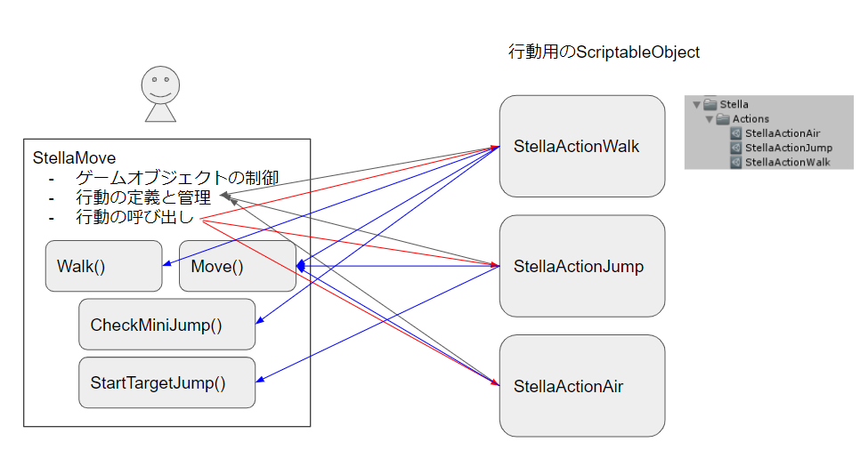
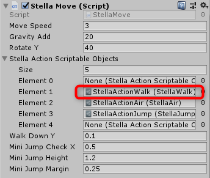

# プレイヤーの行動を開発する
ステラは動きが複雑なため、歩く、水を撒く、苗を運ぶ、ツタにつかまるなどの行動を状態として定義して、状態を切り替えながら制御するのがよい。

設計時では、以下のような行動を挙げて、行動を制御する`StellaMove`スクリプトで定義している。

```cs
/// <summary>
/// ステラの行動定義
/// </summary>
public enum ActionType
{
    None = -1,
    Start,    // 0開始時の演出
    Walk,     // 1立ち、歩き
    Air,      // 2落下、着地
    Jump,     // 3ジャンプまでのアニメ
    Water,    // 4水まき
    Pickup,   // 5苗を持ち上げる
    NaeMove,  // 6苗運び
    Putdown,  // 7苗を置く
    Ivy,      // 8ツタにつかまる
    Watage,   // 9綿毛につかまる
    Tamanori, // 10岩にのる
    Obore,    // 11溺れ
    Clear     // 12ステージクリア
}
```

それぞれの行動で操作や他の行動に移る条件が異なる。これをまとめて制御しようとするとコードが複雑になるので、そのまま実装するのは現実的ではない。

重要なのは、これらの動作は排他的（はいたてき）であるということである。排他的とは、一つが選ばれている時は、他のものが同時に選ばれることがないということである。例えば、歩いている時は、同時にジャンプしない、ということである。

排他的である場合は、上記のように列挙子で状態を宣言して、`nowAction`のような変数に現在の状態を記録して、その値に基づいて処理を分岐させる方法が考えられる。これにより、各状態を別のメソッドやクラスに実装を分けられるので、個々の行動のコードがシンプルになり、処理が混ざることがなくなる。

この方式は、シーン管理などでも有効である。コードを分ける方法は、`switch`や`if`で分けたり、今回利用するポリモーフィズムを使ったり、デリゲーターを使って処理を登録したり、いくつか考えられるが、根本的な発想としては、何らかの方法で現在の状態を記録しておいて、それに合った処理を呼び出す、という考え方である。

# Greeningでの実装
今回は、上記の列挙型で状態を宣言したうえで、各行動をScriptableObjectでアセットとして生成して、StellaMoveに配列として登録する方法を選んだ。この方法によるメリットは以下の通り。

- switch文を排除できる
- コードを分割できるので、StellaMoveを肥大化を抑えられる
- 各行動専用のパラメーターはScriptableObjectで設定できるので、StellaMoveをシンプルにできる
- MonoBehaviourにしないので、余計なUpdateなどの呼び出しを避けられる

ScriptableObjectについては、以下を参照のこと。

- [Unity公式マニュアル ScriptableObject](https://docs.unity3d.com/ja/2017.4/Manual/class-ScriptableObject.html)
- [kan_kikuchi. ScriptableObjectとは](http://kan-kikuchi.hatenablog.com/entry/What%27s_Scriptableobject)

今回の実装では、`StellaMove`スクリプトをステラのゲームオブジェクトにアタッチしていて、これがゲームオブジェクトを動かすことと、状態を管理して、必要な処理を呼び出すことを担当する。歩く、ジャンプする、落下するなどの汎用的な動きや、段差を確認するなどのゲームオブジェクトと綿密に関連する処理も、こちらに実装しておいて、ScriptableObjectから呼び出すようにする。

ScriptableObjectでは主に、行動に必要なStellaMoveのメソッドの呼び出しと、行動の切り替え判定を行う。メソッドの呼び出しがメインなので、コードは短い。




# 行動の増やし方
歩き動作の作成手順を示す。

## 行動用ScriptableObjectの作成

- *Scripts/Stella*フォルダーの中に、`Stella???`という名前のスクリプトを作成。歩きでは`StellaWalk`
- 作成したスクリプトをダブルクリックして開く
- クラス宣言のところを以下のようにする。これによる効果は以下の通り
  - *Project*ウィンドウの*Create*に`Greening/Stella Actins/Create Walk`というメニューを追加
  - メニューを選んで作成されるアセットのデフォルトのファイル名を`StellaActionWalk`にする
  - クラス`StellaActionScriptableObject`を継承する

```cs
[CreateAssetMenu(menuName = "Greening/Stella Actions/Create Walk", fileName = "StellaActionWalk")]
public class StellaWalk : StellaActionScriptableObject
```

これで、*Project*ウィンドウの*Create*ボタンを押すと、*Greening*というメニューが追加されて、*StellaActions* > *Create Walk*の順に選択すると、ScriptableObjectのアセットが生成されるようになる。このようにすることで、このStellaWalkに設定した変数とメソッドを、*Inspector*ウィンドウを通じて、アセットとして登録することができるようになる。

## StellaActionScriptableObject
このスクリプトには、*StellaMove*スクリプトから呼び出すメソッドが定義されている。定義されているのは以下の通り。

- Init()
  - アクションの開始時に呼び出されるメソッド
  - 必要な初期化処理があれば、ここに実装する
- UpdateAction()
  - FixedUpdate()から呼び出されるメソッド
  - この行動で必要な処理をStellaMoveから呼び出したり、ここに実装する
- End()
  - 行動を終了する時に呼び出されるメソッド
  - 行動が完了した時に実行したいコードを実装する
- OnTriggerEnter() / Stay() / Exit()
- OnCollisionEnter() / Stay() / Exit()
  - それぞれの衝突時に呼び出される

実装する場合は、`override`キーワードをつけて、同じ名前でメソッドを定義する。これをオーバーライド(上書き)と呼び、オブジェクト指向言語のクラスの機能の一つである。

例えば、歩きでは以下のメソッドをオーバーライドして実装している。

```cs
public override void Init()
{
    StellaMove.instance.SetAnimState(StellaMove.AnimType.Walk);
}

public override void UpdateAction()
{
    StellaMove.instance.Walk();
    StellaMove.instance.Gravity();
    StellaMove.instance.Move();

    if (!StellaMove.chrController.isGrounded)
    {
        StellaMove.instance.SetAnimState(StellaMove.AnimType.Jump);
        StellaMove.instance.ChangeAction(StellaMove.ActionType.Air);
        StellaMove.myVelocity.x = 0f;
    }
    else
    {
        StellaMove.instance.CheckMiniJump();
    }
}
```

Init()は初期化処理で、アニメーションを歩きに切り替える処理を実装している。この行動に変更したら、自動的に歩きアニメに切り替わる。

UpdateAction()では、歩きと重力落下を処理したうえで、Move()で実際に動かしている。

今回の設計では、最終的に`Move()`を呼び出すことで、そこまでに準備した速度を実際に反映させるようにしている。

`Move()`の後で、chrControllerの状態が更新されるので、`isGrounded`を確認して、着地や落下への移行を処理している。

まだ、キノコジャンプやツタ、水への転落のミスを実装していないので、以上で完了である。使っていないEnd()メソッドなどは、自動的に親クラスの空のメソッドが呼ばれるようになっているので、省略してよい。

この後、キノコや水没などの処理を追加する際には、そのためのコードをここに追加していく。

## アセットを生成して、StellaMoveに登録
行動ができたら、以下の手順でアセットを作成して、StellaMoveにアタッチする。

- *Project*ウィンドウの*Create*ボタンから、*Greening* > *Stella Actions* > *Create Walk*を選んで、アセットを作成する
- *Project*ウィンドウから*Stella*プレハブをクリックして選択
- *Project*ウィンドウから、作成した*StellaActionWalk*アセットをドラッグして、*Inspector*ウィンドウの*Stella Move*コンポーネントにある*Stella Action Scriptable Objects*欄の、歩きに該当する*Element 1*にドロップする



アタッチするスロットは、ActionTypeの定義と一致させる。ActionType.Walkが1なので、*Element 1*にアタッチした。


# StellaMoveについて
*Stella Action Scriptable Objects*欄にアタッチしたScriptableObjectのアセットは、*StellaMove*から以下のように呼び出している。

```cs
    stellaActionScriptableObjects[(int)nowAction]?.UpdateAction();
```

上記は、FixedUpdate()から`UpdateAction()`を呼び出している。ScriptableObjectのアセットを配列で定義しておくことで、列挙子の値を添え時にして`UpdateAction()`を呼び出せば、現在の状態の処理だけを呼び出すことができる。

# 最後に
ScriptableObjectはUnityでデータとスクリプトをアセットとして扱うための機能である。*Inspector*を使って、データを個々のアクションに設定する必要があるかも知れない、と考えて採用したが、その必要がなければ普通のクラスやインターフェースで同じことはできる。

**クラスの継承**と**Interface**、**ポリモーフィズム**あたりを調べると、今回やったことの原理や応用方法を知ることができる。

また、UnityActionを使って処理を登録する方法もある。似たようなことを実現するための多くの方法があることを確認しておくとよい。
