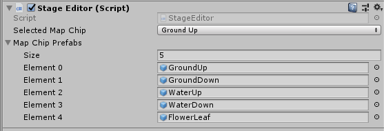

# 簡易ステージエディター
ステージを構築するための簡易なステージエディターを作りたい。

## 要件
- Inspectorで、マップを構成するマップチップのプレハブを設定できる
- 置きたいマップチップの種類を、Inspectorで設定できる
- マウスでクリックした場所の、奥行きが0、XとYは整数に丸め込んだ座標に、選択中のマップチップを生成する
- すでにマップチップが置かれていたら、削除してから置く
- 置いたマップチップを削除する
- カメラをスクロールできる
- 保存は、ドラッグ＆ドロップでプレハブ化すればよい



# 実装方法を検討する
以下を検討して、仕様を決定する。

## Inspectorで、マップを構成するマップチップのプレハブを設定
GameObject型の配列で宣言する。

## 置きたいマップチップの種類を、Inspectorで設定
enum(列挙型)が便利。

```cs
    [SerializeField]
    MapType selectedMapChip = MapType.GroundUp;
```

## マウスでクリックした場所の、奥行きが0、XとYは整数に丸め込んだ座標に、選択中のマップチップを生成
### マウスでクリックしたワールド座標の求め方

```cs
Camera myCam = Camera.main;
Vector3 mpos = Input.mousePosition;
```

以上を宣言してから、コードを続けていく。

- マウスでクリックした座標を、ワールド座標に変換するには、どのような関数を使えばよいか？
- transform.positionは、オブジェクトの座標を確認したり、設定するためのもの。今回の用途ではない
- スクリーン座標はxとyで指定。zには**0-カメラのZ**。0=求めたいワールド座標のカメラからの奥行き
- `myCam.ScreenToWorldPoint(スクリーン座標=マウスの座標)`

### X,Y座標の丸め込み方
- 0.2 = 0
- 0.4 = 0
- -0.4 = 0
- 0.51 = 1
- -0.51 = -1
- 丸め込みの代表例=四捨五入
- 切り捨て=消費税計算はこれ
- 切り上げ=切り捨ての逆
- 今回やりたいこと
  - 一番近い整数にしたい
  - `Mathf.Round()`でXとYを丸め込む。Zは0

### マップチッププレハブの作り方。Pivot(ピボット)とは
- Pivotとは、軸(=中心)
- マップチップ用のオブジェクトは親子階層にして、モデルデータは子供に配置する。これによって、大きさやPivotの調整が簡単にできる
- プレハブから、オブジェクトを生成するには？
  - `Instantiate` インスタンシエイト

## 置いたマップチップを削除
- `Destroy(ゲームオブジェクト)`

## すでにマップチップが置かれていたら、削除してから置く
- https://docs.unity3d.com/ja/2017.4/ScriptReference/Physics.RaycastNonAlloc.html

## カメラをスクロール
- 矢印キーやWASDで動かせばよい

# マップチップの生成
`Instantiate()`を使ってオブジェクトを生成すると、プレハブとの連携が途切れてしまう。そこで、Unityエディター上でしか利用できないエディターメソッドである`PrefabUtility.InstantiatePrefab()`でオブジェクトを生成するとよい。

なお、このスクリプトはエディター専用のため、ビルド時にコードが残っているとエラーが発生する。`#if UNITY_EDITOR`～`#endif`で囲んでおくこと。
